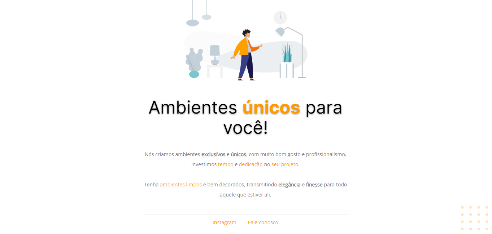

<h1 align="center"> Móveis Personalizados.</h1>

Desafio 01 RocketSeat.

  <a href="#-tecnologias">Tecnologias</a>&nbsp;&nbsp;&nbsp;|&nbsp;&nbsp;&nbsp;
  <a href="#-projeto">Projeto</a>&nbsp;&nbsp;&nbsp;

 

  

## 🚀 Tecnologias

Esse projeto foi desenvolvido com as seguintes tecnologias:

- HTML e CSS;

## 💻 Projeto

Conteúdo do desafio 01 no Explorer da RocketSeat
## 🔖 Layout

Você pode visualizar o resultado clincando neste [LINK](https://kiqprado.github.io/One/).

---

 
 
  
  &nbsp;&nbsp;&nbsp;|&nbsp;&nbsp;&nbsp;
  
 

